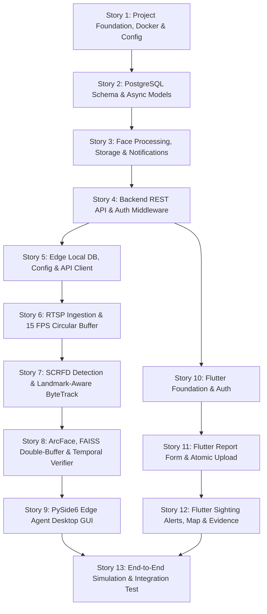

# FIND-MISSING-PEP — Strictly Sequential Development Stories

> **Methodology Reference**: Derived directly from [DOC/5-Architecture.md](file:///c:/SSD%20WINDOW/code/FIND%20-MISSING%20PEP/DOC/5-Architecture.md) and hardened against all 26 architectural bugs, mathematical flaws, and runtime blockers identified in [DOC/6-Architecture-Mistakes-and-Flaws.md](file:///c:/SSD%20WINDOW/code/FIND%20-MISSING%20PEP/DOC/6-Architecture-Mistakes-and-Flaws.md).
>
> **Execution Strategy**:
> - Each story is **strictly sequential** (Story $N$ depends only on Stories $1 \dots N-1$).
> - Each story is **self-contained** and bounded to standard **LLM Context Window Limits** (~3,000–8,000 output tokens).
> - Every story contains:
>   1. **Target Files**: Exact created/modified file paths.
>   2. **Architectural Bugfixes Addressed**: Cross-referenced against `DOC/6-Architecture-Mistakes-and-Flaws.md`.
>   3. **Detailed Implementation Specification**: Data models, classes, methods, mathematical thresholds, and edge-case contracts.
>   4. **Automated Verification Command**: Non-interactive CLI verification command with expected assertions.
>   5. **LLM-Ready Prompt Snippet**: Complete, copy-paste ready prompt formatted for zero-shot LLM code generation.

---

## Master Story Dependency Map



---

## Story Overview & Sizing Index

| Story # | Component | Scope / Title | Output Token Budget | Key Architectural Fixes |
|---|---|---|:---:|---|
| **Story 1** | Backend / Infra | Foundation, Dockerfile, Dependencies & Config | ~3,500 | Fix #1, #2, #5, #20, #23, #24 |
| **Story 2** | Backend DB | PostgreSQL Database Schema & Alembic Migrations | ~4,500 | Fix #15, #16, #17, #24 |
| **Story 3** | Backend Logic | Face Processing, Storage & Notification Services | ~5,500 | Fix #2, #10, #15, #16, #19 |
| **Story 4** | Backend API | REST API Layer, Admin Enrollment & Static Mount | ~6,500 | Fix #17, #18, #19, #20 |
| **Story 5** | Edge Agent | SQLite Storage, Evidence Store & Network Client | ~5,000 | Fix #3, #4, #13, #15, #17, #18 |
| **Story 6** | Edge Agent | RTSP Ingestion, ONVIF & 15 FPS Circular Buffer | ~5,000 | Fix #7, #12, #17, #25, #26 |
| **Story 7** | Edge AI Core | SCRFD Detection & Landmark-Carrying ByteTrack | ~6,000 | Fix #3, #4, #7, #9, #25 |
| **Story 8** | Edge AI Core | ArcFace, FAISS Double-Buffering & Temporal Verifier | ~6,500 | Fix #6, #8, #11, #12, #14 |
| **Story 9** | Edge Agent UI | PySide6 Desktop GUI, Feed Widgets & Alert Dialog | ~7,000 | Fix #6, #23, #26 |
| **Story 10** | Mobile App | Flutter Core, Riverpod, GoRouter & Auth Service | ~5,000 | Fix #21, #22 |
| **Story 11** | Mobile App | Report Submission, Atomic Multipart & Photo Upload | ~6,000 | Fix #18, #19 |
| **Story 12** | Mobile App | Push Notifications, Map Timeline & Evidence Review | ~6,500 | Fix #16, #22 |
| **Story 13** | E2E Testing | Mock RTSP Generator & Synthetic E2E Test Suite | ~5,000 | Full Pipeline Integration |

---

# Phase 1: Foundation & Backend Data Layer

---

## Story 1: Project Foundation, Dockerfile, Dependencies & Environment Config

### 1.1 Objective & Scope
Set up the production-ready project skeleton, pinned dependency manifests, environment variable schemas, multi-stage Debian-compatible Dockerfile with pre-warmed model assets, docker-compose orchestration, and PyInstaller-compatible path resolution utilities.

### 1.2 Sequence Dependencies
- **Prerequisites**: None (Initial repository root setup).

### 1.3 Architectural Bugfixes Addressed
- **Fix #1**: Replaced deprecated `libgl1-mesa-glx` with `libgl1` and `libglib2.0-0` in `backend/Dockerfile`.
- **Fix #2**: Pre-warmed InsightFace models in `backend/Dockerfile` by invoking `.prepare(ctx_id=-1, det_size=(640, 640))`.
- **Fix #5**: Removed `aioredis` namespace collision; pinned `redis>=5.0.0` and imported `redis.asyncio`.
- **Fix #20**: Added `ADMIN_ENROLLMENT_KEY` to backend environment configuration for securing edge agent registration.
- **Fix #23**: Created `edge_agent/utils/path_resolver.py` supporting `sys._MEIPASS` for PyInstaller packaging.
- **Fix #24**: Added `RTSP_SECRET_KEY` in environment for AES-GCM credential encryption.

### 1.4 Target Files
```
backend/
├── requirements.txt                    [CREATED/UPDATED]
├── .env.example                        [CREATED/UPDATED]
├── Dockerfile                          [CREATED/UPDATED]
├── docker-compose.yml                  [CREATED/UPDATED]
├── app/
│   ├── __init__.py                     [CREATED]
│   └── config.py                       [CREATED/UPDATED]
scripts/
└── download_models.py                  [CREATED/UPDATED]
edge_agent/
└── utils/
    ├── __init__.py                     [CREATED]
    └── path_resolver.py                [CREATED]
```

### 1.5 Detailed Implementation Specification
1. **`backend/requirements.txt`**:
   - Pinned versions: `fastapi==0.110.0`, `uvicorn[standard]==0.28.0`, `pydantic-settings==2.2.1`, `sqlalchemy==2.0.28`, `asyncpg==0.29.0`, `alembic==1.13.1`, `redis==5.0.3`, `python-multipart==0.0.9`, `httpx==0.27.0`, `cryptography==42.0.5`, `insightface==0.7.3`, `onnxruntime==1.17.1`, `opencv-python-headless==4.9.0.80`, `firebase-admin==6.5.0`, `pytest==8.1.1`, `pytest-asyncio==0.23.6`.
2. **`backend/.env.example`**:
   - Include: `POSTGRES_USER`, `POSTGRES_PASSWORD`, `POSTGRES_DB`, `POSTGRES_HOST=localhost`, `POSTGRES_PORT=5432`, `REDIS_URL=redis://localhost:6379/0`, `ADMIN_ENROLLMENT_KEY=dev-enroll-secret-change-me`, `RTSP_SECRET_KEY=32bytehexsecretforaesencryption00`, `UPLOAD_DIR=./uploads`, `FIREBASE_CREDENTIALS_PATH=./firebase-sa.json`, `AI_MODEL_DIR=./ai_models`.
3. **`backend/app/config.py`**:
   - Pydantic Settings class `Settings` reading from `.env` with fallback defaults.
   - Property `DATABASE_URL_ASYNC` formatting `postgresql+asyncpg://...`.
4. **`backend/Dockerfile`**:
   - Debian 12 (Bookworm) compatible base `python:3.11-slim`.
   - Install `libgl1`, `libglib2.0-0`, `libpq-dev`, `curl`.
   - Install dependencies, copy model download script, run InsightFace `.prepare(ctx_id=-1, det_size=(640, 640))` during build to embed models in image.
5. **`docker-compose.yml`**:
   - Services: `postgres` (image `postgres:16-alpine`), `redis` (image `redis:7-alpine`), `backend` (build `backend/`).
   - Volumes for postgres data and backend uploads.
6. **`edge_agent/utils/path_resolver.py`**:
   - Provide `get_resource_path(relative_path: str) -> str`: checks `getattr(sys, '_MEIPASS', os.path.abspath('.'))`.

### 1.6 Automated Verification Command
```powershell
docker compose config && python -c "from backend.app.config import settings; print('Config OK:', settings.ADMIN_ENROLLMENT_KEY)" && python edge_agent/utils/path_resolver.py
```
*Expected Output*: Valid docker compose YAML output, `Config OK: dev-enroll-secret-change-me`, and successful execution of path resolver.

### 1.7 LLM-Ready Prompt Snippet
````markdown
You are an expert systems engineer implementing Story 1 of the FIND-MISSING-PEP system.
Your task is to create the foundational configuration, environment definitions, container manifests, and path resolver.

CRITICAL REQUIREMENTS:
- In `backend/Dockerfile`, do NOT use `libgl1-mesa-glx` (Debian 12 removed it). Use `libgl1` and `libglib2.0-0`.
- In `backend/Dockerfile`, execute InsightFace model pre-warming via `.prepare(ctx_id=-1, det_size=(640, 640))` so models are downloaded at container build time.
- In `backend/requirements.txt`, use `redis>=5.0.0` and DO NOT include `aioredis`.
- In `backend/app/config.py`, include `ADMIN_ENROLLMENT_KEY` and `RTSP_SECRET_KEY`.
- In `edge_agent/utils/path_resolver.py`, implement `get_resource_path()` handling `sys._MEIPASS`.

Target Files:
- backend/requirements.txt
- backend/.env.example
- backend/app/config.py
- backend/Dockerfile
- docker-compose.yml
- edge_agent/utils/path_resolver.py
- scripts/download_models.py

Generate clean, production-grade files.
````

---

## Story 2: Central PostgreSQL Schema & Asynchronous SQLAlchemy ORM Models

### 2.1 Objective & Scope
Implement the complete relational database layer in PostgreSQL 16 using SQLAlchemy 2.0 Async declarative models and Alembic migration scripts. Ensure all foreign key deletion cascades, audit fields, and synchronization columns are strictly implemented.

### 2.2 Sequence Dependencies
- **Prerequisites**: Story 1 (environment config and dependencies).

### 2.3 Architectural Bugfixes Addressed
- **Fix #10**: Explicitly declared `ON DELETE CASCADE` on `sightings.person_id -> missing_persons.id` to prevent foreign key deletion traps.
- **Fix #15**: Added `updated_at` (TIMESTAMPTZ) and `is_active` (BOOLEAN) to `face_embeddings` table to enable deterministic incremental tombstone sync.
- **Fix #17**: Standardized `cameras.id` as `UUID PRIMARY KEY DEFAULT gen_random_uuid()` and added unique compound index on `(agent_id, local_camera_id)`.
- **Fix #24**: Structured `cameras.rtsp_url` storage for AES-256-GCM encrypted strings (`encrypted_rtsp_url`).

### 2.4 Target Files
```
backend/
├── alembic.ini                         [CREATED]
├── alembic/
│   ├── env.py                          [CREATED]
│   ├── script.py.mako                  [CREATED]
│   └── versions/
│       └── 001_initial_schema.py       [CREATED]
└── app/
    ├── database.py                     [CREATED]
    └── models/
        ├── __init__.py                 [CREATED]
        ├── base.py                     [CREATED]
        ├── user.py                     [CREATED]
        ├── missing_person.py           [CREATED]
        ├── photo.py                    [CREATED]
        ├── face_embedding.py           [CREATED]
        ├── edge_agent.py               [CREATED]
        ├── camera.py                   [CREATED]
        ├── sighting.py                 [CREATED]
        ├── notification.py             [CREATED]
        └── audit_log.py                [CREATED]
```

### 2.5 Detailed Implementation Specification
1. **`backend/app/database.py`**:
   - `create_async_engine(settings.DATABASE_URL_ASYNC, pool_size=10, max_overflow=20)`.
   - `async_sessionmaker(engine, expire_on_commit=False, class_=AsyncSession)`.
   - Dependency helper `async def get_db() -> AsyncGenerator[AsyncSession, None]`.
2. **`backend/app/models/base.py`**:
   - `Base(DeclarativeBase)` with `id = Column(UUID(as_uuid=True), primary_key=True, default=uuid4)` and timestamp mixins (`created_at`, `updated_at`).
3. **Key Model Constraints**:
   - `User`: `firebase_uid` (VARCHAR 128, UNIQUE, NOT NULL), `role` (ADMIN, OPERATOR, CITIZEN).
   - `MissingPerson`: `status` enum (`PROCESSING`, `ACTIVE`, `FOUND`, `CLOSED`).
   - `Photo`: `file_path`, `is_primary`, `processing_status` (`PENDING`, `COMPLETED`, `FAILED`).
   - `FaceEmbedding`: `person_id` (FK to `missing_persons.id` ON DELETE CASCADE), `photo_id` (FK to `photos.id` ON DELETE SET NULL), `embedding_vector` (BYTEA, 512 float32 = 2048 bytes), `is_active` (BOOLEAN, default True), `updated_at` (TIMESTAMPTZ).
   - `EdgeAgent`: `name`, `api_key_hash`, `enrollment_status`, `last_heartbeat_at`, `is_active`.
   - `Camera`: `agent_id` (FK to `edge_agents.id` ON DELETE CASCADE), `local_camera_id` (VARCHAR 64, e.g. "CAM-01"), `encrypted_rtsp_url` (TEXT), `latitude`, `longitude`.
   - `Sighting`: `person_id` (FK to `missing_persons.id` ON DELETE CASCADE), `camera_id` (FK to `cameras.id` ON DELETE SET NULL), `status` (`POSSIBLE`, `CONFIRMED`, `REJECTED`), `similarity_score`, `face_crop_path`, `full_frame_path`, `video_clip_path`.
4. **`alembic/versions/001_initial_schema.py`**:
   - Comprehensive idempotent raw SQL / SQLAlchemy migration creating all tables, enums, indices, and foreign keys.

### 2.6 Automated Verification Command
```powershell
python -m pytest tests/test_schema.py -v
```
*Expected Output*: 100% pass on model instantiation, schema foreign key validation, and async session connectivity.

### 2.7 LLM-Ready Prompt Snippet
````markdown
You are an expert database architect implementing Story 2 of the FIND-MISSING-PEP system.
Your task is to build the asynchronous SQLAlchemy 2.0 ORM models and Alembic migration scripts.

CRITICAL REQUIREMENTS:
- In `backend/app/models/sighting.py`, the `person_id` foreign key MUST have `ondelete="CASCADE"`!
- In `backend/app/models/face_embedding.py`, include `updated_at` (TIMESTAMPTZ) and `is_active` (BOOLEAN) so incremental tombstone synchronization can track deactivated/found persons.
- In `backend/app/models/camera.py`, store `encrypted_rtsp_url` (TEXT) and include a composite unique constraint on `(agent_id, local_camera_id)`.
- Use SQLAlchemy 2.0 `Mapped` and `mapped_column` type annotations.

Target Files:
- backend/app/database.py
- backend/app/models/base.py
- backend/app/models/user.py
- backend/app/models/missing_person.py
- backend/app/models/photo.py
- backend/app/models/face_embedding.py
- backend/app/models/edge_agent.py
- backend/app/models/camera.py
- backend/app/models/sighting.py
- backend/app/models/notification.py
- backend/app/models/audit_log.py
- backend/app/models/__init__.py
- backend/alembic.ini
- backend/alembic/env.py
- backend/alembic/versions/001_initial_schema.py
- tests/test_schema.py

Generate clean, type-checked Python code.
````

---

# Phase 2: Backend Core Services & REST API

---

## Story 3: Face Processing Service, Evidence Storage & Notification Engine

### 3.1 Objective & Scope
Implement backend domain logic: InsightFace (Buffalo_L) photo processing service (face detection, landmark extraction, affine alignment to 112×112, and 512-D ArcFace embedding generation), filesystem media storage manager, AES-256-GCM RTSP credential cryptography, FCM push notification service, and Redis-backed SSE manager with keepalive heartbeats.

### 3.2 Sequence Dependencies
- **Prerequisites**: Story 1 (config, models download) and Story 2 (ORM models).

### 3.3 Architectural Bugfixes Addressed
- **Fix #10**: Standardized on unified InsightFace model initialization (`FaceAnalysis(name='buffalo_l')`), eliminating the split between raw ONNX sessions and high-level wrappers.
- **Fix #15**: Built incremental embedding sync packaging logic computing `removed_ids` (tombstones) from `face_embeddings.is_active = FALSE` and `missing_persons.status != 'ACTIVE'`.
- **Fix #16**: Implemented Firebase Cloud Messaging (FCM) as the primary push alert channel, gracefully degrading to database notification log if FCM token is missing or offline.
- **Fix #19**: Structured filesystem storage ensuring `/uploads/photos`, `/uploads/faces`, and `/uploads/evidence` directories are created and managed safely.
- **Fix #20**: Embedded a 30-second ping heartbeat in `SSEManager` to prevent reverse proxies and load balancers from severing idle event connections.
- **Fix #24**: Implemented `encrypt_rtsp_url(url: str)` and `decrypt_rtsp_url(token: str)` using `cryptography.fernet.Fernet` or AES-GCM.

### 3.4 Target Files
```
backend/app/
├── utils/
│   ├── __init__.py                     [CREATED]
│   ├── file_storage.py                 [CREATED]
│   └── crypto.py                       [CREATED]
├── services/
│   ├── __init__.py                     [CREATED]
│   ├── face_processing.py              [CREATED]
│   ├── embedding_sync.py               [CREATED]
│   ├── notification_service.py         [CREATED]
│   └── sse_manager.py                  [CREATED]
└── crud/
    ├── __init__.py                     [CREATED]
    ├── photo.py                        [CREATED]
    ├── face_embedding.py               [CREATED]
    └── notification.py                 [CREATED]
```

### 3.5 Detailed Implementation Specification
1. **`backend/app/utils/crypto.py`**:
   - `AESGCMCrypto(secret_key: str)`: encrypt and decrypt RTSP credentials with authentication tag.
2. **`backend/app/utils/file_storage.py`**:
   - `save_upload_file(file: UploadFile, subfolder: str) -> str`: saves bytes safely with UUID filenames, returns relative URL path.
3. **`backend/app/services/face_processing.py`**:
   - Singleton or cached `FaceAnalysis(name='buffalo_l', root=settings.AI_MODEL_DIR, providers=['CPUExecutionProvider'])`.
   - `process_person_photo(image_bytes: bytes) -> Tuple[bytes, np.ndarray, float]`:
     1. Decodes image with OpenCV.
     2. Runs `app.get(image)`.
     3. Checks `len(faces) >= 1`; picks largest face by bounding box area.
     4. Quality validation: detection score $\ge 0.60$, minimum face size $60\times 60$.
     5. Crops aligned $112\times 112$ face thumbnail.
     6. Normalizes 512-D ArcFace embedding: `normed_emb = emb / np.linalg.norm(emb)`.
     7. Returns `(cropped_face_jpg_bytes, normed_emb, det_score)`.
4. **`backend/app/services/embedding_sync.py`**:
   - `get_sync_package(db: AsyncSession, since: Optional[datetime]) -> Dict[str, Any]`:
     - If `since` is None: returns all active embeddings (`is_active=True` and parent report `ACTIVE`).
     - If `since` is provided:
       - Query newly activated / added embeddings: `updated_at >= since AND is_active = True`.
       - Query tombstoned person IDs: `updated_at >= since AND (is_active = False OR parent report != 'ACTIVE')`.
       - Returns `{"full_sync": False, "persons": [...], "removed_ids": [...], "sync_timestamp": now()}`.
5. **`backend/app/services/sse_manager.py`**:
   - `SSEManager`: async message broadcast using `redis.asyncio.pubsub()`.
   - Generator yielding SSE events `event: sighting\ndata: {...}\n\n`.
   - Periodic 30s `:ping\n\n` heartbeat task.
6. **`backend/app/services/notification_service.py`**:
   - Sends FCM message to target user's `fcm_token` with sighting payload.
   - Logs notification record to database (`notifications` table).
   - Publishes event to `SSEManager`.

### 3.6 Automated Verification Command
```powershell
python -m pytest tests/test_face_services.py -v
```
*Expected Output*: Verification of crypto roundtrip, dummy face image detection/embedding extraction, and tombstone sync logic.

### 3.7 LLM-Ready Prompt Snippet
````markdown
You are a senior backend engineer implementing Story 3 of the FIND-MISSING-PEP system.
Your task is to build the face processing service, encrypted RTSP storage, notification dispatcher, and embedding synchronization services.

CRITICAL REQUIREMENTS:
- Use `insightface.app.FaceAnalysis(name='buffalo_l', root=settings.AI_MODEL_DIR)` for face detection and 512-D ArcFace embeddings. Ensure L2 normalization of vectors.
- In `backend/app/services/embedding_sync.py`, properly compute `removed_ids` (tombstones) for reports whose status transitioned to `FOUND` or `CLOSED` or where `is_active` is false.
- In `backend/app/services/sse_manager.py`, use `redis.asyncio` and implement a 30-second ping heartbeat.
- In `backend/app/utils/crypto.py`, implement AES-GCM encryption/decryption for camera credentials.

Target Files:
- backend/app/utils/crypto.py
- backend/app/utils/file_storage.py
- backend/app/services/face_processing.py
- backend/app/services/embedding_sync.py
- backend/app/services/sse_manager.py
- backend/app/services/notification_service.py
- backend/app/crud/photo.py
- backend/app/crud/face_embedding.py
- backend/app/crud/notification.py
- tests/test_face_services.py

Generate clean, test-backed Python code.
````

---

## Story 4: Backend REST API Endpoints, Static Media Mount & Auth Middleware

### 4.1 Objective & Scope
Implement the full FastAPI application factory, Firebase Auth JWT verification dependency, Edge Agent enrollment key authentication, RESTful routing, static file mount for `/uploads`, atomic report creation with multipart photo upload, camera sync, and sighting ingestion.

### 4.2 Sequence Dependencies
- **Prerequisites**: Story 1, 2, and 3.

### 4.3 Architectural Bugfixes Addressed
- **Fix #17**: Implemented `POST /api/agents/{id}/cameras/sync` which takes an agent's locally discovered cameras and returns persistent backend UUIDs.
- **Fix #18**: Added atomic multipart submission `POST /api/reports/` (metadata JSON + 1–5 image files in one request), transitioning directly to `ACTIVE` upon successful face extraction. Added 30-minute cleanup worker for any orphaned `PROCESSING` records.
- **Fix #19**: Mounted `StaticFiles(directory=settings.UPLOAD_DIR)` at `/uploads` in `backend/app/main.py`.
- **Fix #20**: Guarded `POST /api/agents/register` with `X-Enrollment-Key` header verified against `settings.ADMIN_ENROLLMENT_KEY`.

### 4.4 Target Files
```
backend/app/
├── main.py                             [CREATED/UPDATED]
├── schemas/
│   ├── __init__.py                     [CREATED]
│   ├── user.py                         [CREATED]
│   ├── missing_person.py               [CREATED]
│   ├── photo.py                        [CREATED]
│   ├── face_embedding.py               [CREATED]
│   ├── edge_agent.py                   [CREATED]
│   ├── camera.py                       [CREATED]
│   ├── sighting.py                     [CREATED]
│   └── notification.py                 [CREATED]
├── crud/
│   ├── user.py                         [CREATED]
│   ├── missing_person.py               [CREATED]
│   ├── edge_agent.py                   [CREATED]
│   ├── camera.py                       [CREATED]
│   └── sighting.py                     [CREATED]
└── api/
    ├── __init__.py                     [CREATED]
    ├── deps.py                         [CREATED]
    ├── auth.py                         [CREATED]
    ├── users.py                        [CREATED]
    ├── reports.py                      [CREATED]
    ├── agents.py                       [CREATED]
    ├── cameras.py                      [CREATED]
    ├── sightings.py                    [CREATED]
    ├── embeddings.py                   [CREATED]
    ├── notifications.py                [CREATED]
    └── sse.py                          [CREATED]
```

### 4.5 Detailed Implementation Specification
1. **`backend/app/main.py`**:
   - `FastAPI(title="FIND-MISSING-PEP Backend", version="1.0.0")`.
   - Mount CORS middleware (`allow_origins=["*"]`).
   - Mount static file serving: `app.mount("/uploads", StaticFiles(directory=settings.UPLOAD_DIR), name="uploads")`.
   - Lifespan context manager initializing Redis connection pool and periodic cleanup task.
2. **`backend/app/api/auth.py` & `deps.py`**:
   - `get_current_user(token: str = Depends(oauth2_scheme)) -> User`: verifies Firebase ID token via `firebase_admin.auth.verify_id_token()`.
   - `verify_agent_api_key(x_api_key: str = Header(...)) -> EdgeAgent`: hashes incoming key with SHA-256, looks up active `EdgeAgent`.
   - `verify_enrollment_key(x_enrollment_key: str = Header(...))`: validates against `settings.ADMIN_ENROLLMENT_KEY`.
3. **Key Endpoints**:
   - `POST /api/agents/register`: requires `X-Enrollment-Key`. Generates random 32-byte secret API key, stores SHA-256 hash in DB, returns plaintext key once.
   - `POST /api/agents/{id}/cameras/sync`: requires `X-API-Key`. Accepts list of local cameras `[{"local_camera_id": "CAM-01", "name": "Main Gate", "rtsp_url": "rtsp://...", "lat": ..., "lng": ...}]`. Encrypts RTSP URL, inserts or updates DB, returns mapped backend UUIDs: `{"mappings": {"CAM-01": "uuid-..."}}`.
   - `POST /api/reports/`: atomic multipart request. Accepts `report_data: str` (JSON string containing name, age, gender, last_seen details) and `photos: List[UploadFile]`. Creates DB record, runs face processing on each photo, stores embeddings, sets status to `ACTIVE`. If face processing fails on all photos, rolls back or sets status `REJECTED_NO_FACE`.
   - `GET /api/embeddings/sync?since=...`: requires `X-API-Key`. Returns JSON or binary embedding package with `persons` (embedding vectors base64 encoded) and `removed_ids`.
   - `POST /api/sightings/`: requires `X-API-Key`. Accepts multipart evidence (face crop, full frame, optional video clip, `camera_id` UUID, `person_id` UUID, `similarity_score`, `timestamp`). Dispatches FCM push and SSE alert to report owner.

### 4.6 Automated Verification Command
```powershell
python -m pytest tests/test_api_endpoints.py -v
```
*Expected Output*: 100% pass on auth dependencies, agent enrollment, camera sync with UUID generation, multipart report creation, and static route resolution.

### 4.7 LLM-Ready Prompt Snippet
````markdown
You are a senior API architect implementing Story 4 of the FIND-MISSING-PEP system.
Your task is to build the complete FastAPI routing layer, security dependencies, and static file mounts.

CRITICAL REQUIREMENTS:
- Mount `StaticFiles(directory=settings.UPLOAD_DIR)` at `/uploads` in `main.py`.
- Protect `POST /api/agents/register` with `X-Enrollment-Key` matching `settings.ADMIN_ENROLLMENT_KEY`.
- Implement `POST /api/agents/{id}/cameras/sync` returning a mapping of local camera identifiers (e.g. "CAM-01") to backend UUIDs.
- Implement atomic multipart submission in `POST /api/reports/` accepting both metadata and photo files in a single request.
- Provide dependency `get_current_user` validating Firebase JWTs and `verify_agent_api_key` validating Edge Agent API keys.

Target Files:
- backend/app/main.py
- backend/app/api/deps.py
- backend/app/api/auth.py
- backend/app/api/agents.py
- backend/app/api/cameras.py
- backend/app/api/reports.py
- backend/app/api/sightings.py
- backend/app/api/embeddings.py
- backend/app/api/notifications.py
- backend/app/api/sse.py
- backend/app/schemas/*
- tests/test_api_endpoints.py

Generate production-grade, well-typed code with comprehensive status codes.
````

---

# Phase 3: Edge Agent Ingestion & Local Storage

---

## Story 5: Edge Agent Local Storage, Offline Queue & Network Client

### 5.1 Objective & Scope
Set up the Edge Agent Python application foundation, pinned dependencies, SQLite local cache with proper schemas, offline pending sighting queue with exponential retry backoff, and HTTP client communicating with backend endpoints.

### 5.2 Sequence Dependencies
- **Prerequisites**: Story 4 (backend endpoints ready for sync/upload).

### 5.3 Architectural Bugfixes Addressed
- **Fix #3**: Configured `edge_agent/requirements.txt` with `lapx>=0.5.5` (compatible with Windows x64 binary wheels) and modern pinned packages.
- **Fix #4**: Excluded deprecated `filterpy` referencing deleted `np.float`.
- **Fix #13**: Fixed SQLite primary key collision by defining `cached_embeddings` with `id TEXT PRIMARY KEY` (embedding UUID) and an index on `person_id`.
- **Fix #15**: Handled incremental tombstone synchronization: parsed `removed_ids` from sync responses and removed deleted/found person vectors from SQLite.
- **Fix #17**: Created `camera_mappings` table in SQLite `(local_camera_id TEXT PRIMARY KEY, backend_uuid TEXT NOT NULL)`.
- **Fix #18**: Implemented local pending sighting queue in SQLite to guarantee zero evidence loss during network interruptions.

### 5.4 Target Files
```
edge_agent/
├── requirements.txt                    [CREATED/UPDATED]
├── config.py                           [CREATED]
├── config.ini                          [CREATED]
├── storage/
│   ├── __init__.py                     [CREATED]
│   ├── local_db.py                     [CREATED]
│   ├── evidence_store.py               [CREATED]
│   └── faiss_store.py                  [CREATED]
└── network/
    ├── __init__.py                     [CREATED]
    ├── api_client.py                   [CREATED]
    ├── embedding_syncer.py             [CREATED]
    ├── sighting_uploader.py            [CREATED]
    └── sse_listener.py                 [CREATED]
```

### 5.5 Detailed Implementation Specification
1. **`edge_agent/requirements.txt`**:
   - Pinned: `pyside6==6.6.2`, `opencv-python==4.9.0.80`, `onnxruntime==1.17.1`, `faiss-cpu==1.7.4`, `lapx>=0.5.5`, `numpy>=1.26.0`, `httpx==0.27.0`, `scipy>=1.12.0`, `wsdiscovery==2.0.0`, `pytest==8.1.1`.
2. **`edge_agent/storage/local_db.py`**:
   - `SQLiteStore(db_path: str)`:
     - Table `sync_state (key TEXT PRIMARY KEY, value TEXT)`.
     - Table `camera_mappings (local_camera_id TEXT PRIMARY KEY, backend_uuid TEXT NOT NULL, updated_at TEXT)`.
     - Table `cached_embeddings (id TEXT PRIMARY KEY, person_id TEXT NOT NULL, person_name TEXT, embedding_data BLOB NOT NULL, photo_url TEXT, synced_at TEXT)`. Index on `person_id`.
     - Table `pending_sightings (id TEXT PRIMARY KEY, person_id TEXT NOT NULL, camera_uuid TEXT NOT NULL, similarity_score REAL, crop_path TEXT, frame_path TEXT, clip_path TEXT, detected_at TEXT, retry_count INT DEFAULT 0)`.
3. **`edge_agent/network/api_client.py`**:
   - Asynchronous / thread-safe `httpx.Client` wrapper configured with `base_url`, `timeout=15.0`, and default header `X-API-Key: settings.AGENT_API_KEY`.
4. **`edge_agent/network/embedding_syncer.py`**:
   - Queries `GET /api/embeddings/sync?since={last_synced_at}`.
   - For added embeddings: stores BLOBs in SQLite `cached_embeddings`.
   - For `removed_ids`: deletes all rows matching `person_id IN (...)`.
   - Updates `sync_state.last_synced_at`.
5. **`edge_agent/network/sighting_uploader.py`**:
   - Reads pending sightings from SQLite.
   - Uploads multipart payload to `POST /api/sightings/`.
   - Upon HTTP 200/201: deletes local queue record and cleans up uploaded evidence files if disk threshold exceeded.
   - Upon network failure: increments `retry_count` with exponential backoff.

### 5.6 Automated Verification Command
```powershell
python -m pytest edge_agent/tests/test_storage_network.py -v
```
*Expected Output*: Successful verification of SQLite multi-embedding storage per person, tombstone pruning, and queue serialization.

### 5.7 LLM-Ready Prompt Snippet
````markdown
You are an expert Edge-AI software engineer implementing Story 5 of the FIND-MISSING-PEP system.
Your task is to build the Edge Agent local storage, network client, and offline synchronization workers.

CRITICAL REQUIREMENTS:
- In `edge_agent/requirements.txt`, use `lapx>=0.5.5` instead of `lap` (Windows binary support).
- In `edge_agent/storage/local_db.py`, the `cached_embeddings` table MUST use `id TEXT PRIMARY KEY` with an index on `person_id` (one person can have multiple photos/embeddings).
- Implement `camera_mappings` table to translate local camera names (e.g. "CAM-01") into remote backend UUIDs.
- In `embedding_syncer.py`, parse `removed_ids` and remove deleted persons from SQLite.
- In `sighting_uploader.py`, implement durable offline queue processing with exponential backoff.

Target Files:
- edge_agent/requirements.txt
- edge_agent/config.py
- edge_agent/config.ini
- edge_agent/storage/local_db.py
- edge_agent/storage/evidence_store.py
- edge_agent/storage/faiss_store.py
- edge_agent/network/api_client.py
- edge_agent/network/embedding_syncer.py
- edge_agent/network/sighting_uploader.py
- edge_agent/network/sse_listener.py
- edge_agent/tests/test_storage_network.py

Generate reliable, defensive Python code.
````

---

## Story 6: CCTV Stream Ingestion, Hardware Decode & 15 FPS Circular Frame Buffer

### 6.1 Objective & Scope
Implement multi-camera CCTV ingestion via OpenCV with automatic reconnection, ONVIF local network camera discovery, hardware-accelerated decoding flags, and a memory-bounded circular frame buffer storing 15 FPS pre-and-post event video clips.

### 6.2 Sequence Dependencies
- **Prerequisites**: Story 5 (edge config and local storage).

### 6.3 Architectural Bugfixes Addressed
- **Fix #7**: Ingests and buffers CCTV streams at native or 15 FPS, preventing frame drops and enabling smooth 10–15 FPS tracking.
- **Fix #12**: Built `CircularFrameBuffer(maxlen=150)` in `camera/circular_buffer.py` allowing instant export of a 10-second (150-frame) 15 FPS MP4 video clip when a match is verified.
- **Fix #17**: Set `CAP_PROP_BUFFERSIZE=1` and `rtsp_transport=tcp` to eliminate network buffer latency and green frame artifacts.
- **Fix #25**: Implemented hardware decoding acceleration flags (`cv2.CAP_FFMPEG` with DXVA2 / Direct3D11 on Windows).
- **Fix #26**: Implemented cooperative thread shutdown via `_stop_event = threading.Event()`.

### 6.4 Target Files
```
edge_agent/camera/
├── __init__.py                         [CREATED]
├── circular_buffer.py                  [CREATED]
├── frame_sampler.py                    [CREATED]
├── rtsp_reader.py                      [CREATED]
├── onvif_discovery.py                  [CREATED]
└── stream_manager.py                   [CREATED]
```

### 6.5 Detailed Implementation Specification
1. **`edge_agent/camera/circular_buffer.py`**:
   - `CircularFrameBuffer(maxlen: int = 150)`:
     - Thread-safe deque storing `Tuple[float, np.ndarray]` (timestamp, BGR frame).
     - `dump_video(output_path: str, fps: float = 15.0) -> bool`: writes all buffered frames to an H.264 / mp4v `.mp4` file via `cv2.VideoWriter`.
2. **`edge_agent/camera/rtsp_reader.py`**:
   - `RTSPReader(rtsp_url: str, camera_id: str)`:
     - Thread loop capturing frames via `cv2.VideoCapture`.
     - Appends every frame to `CircularFrameBuffer`.
     - Flags: `cv2.CAP_PROP_BUFFERSIZE = 1`.
     - Exponential backoff reconnection loop upon stream disconnect: `backoff = [1, 2, 5, 10, 30]`.
     - Cooperative cancellation: checks `self._stop_event.is_set()` every iteration.
3. **`edge_agent/camera/onvif_discovery.py`**:
   - Uses `wsdiscovery.WSDiscovery` to broadcast WS-Discovery probes on the local subnet.
   - Extracts device XAddrs, queries camera RTSP URI, returns list of candidate camera endpoints.
4. **`edge_agent/camera/stream_manager.py`**:
   - Manages the lifecycle of 1–4 concurrent camera streams.
   - Synchronizes camera metadata with backend using `POST /api/agents/{id}/cameras/sync`.

### 6.6 Automated Verification Command
```powershell
python -m pytest edge_agent/tests/test_stream_buffer.py -v
```
*Expected Output*: Verified 150-frame circular buffer dump to valid MP4 file and RTSP reconnect backoff state machine.

### 6.7 LLM-Ready Prompt Snippet
````markdown
You are an expert video systems engineer implementing Story 6 of the FIND-MISSING-PEP system.
Your task is to build the CCTV RTSP reader, ONVIF discovery, and 15 FPS circular buffer.

CRITICAL REQUIREMENTS:
- In `circular_buffer.py`, implement `CircularFrameBuffer(maxlen=150)` with thread-safe `dump_video(output_path, fps=15.0)` to write a 10-second clip upon match.
- In `rtsp_reader.py`, use TCP transport (`?rtsp_transport=tcp`), set `CAP_PROP_BUFFERSIZE=1`, and implement exponential backoff reconnection.
- Use cooperative thread termination using `_stop_event = threading.Event()`. Do NOT rely on abrupt thread killing.
- In `stream_manager.py`, orchestrate 1 to 4 streams and synchronize local camera IDs with backend UUIDs.

Target Files:
- edge_agent/camera/circular_buffer.py
- edge_agent/camera/frame_sampler.py
- edge_agent/camera/rtsp_reader.py
- edge_agent/camera/onvif_discovery.py
- edge_agent/camera/stream_manager.py
- edge_agent/tests/test_stream_buffer.py

Generate high-performance, robust Python code.
````

---

# Phase 4: Edge AI Core (Research Novelty)

---

## Story 7: SCRFD Face Detection, Landmark Quality Gate & Extended ByteTrack

### 7.1 Objective & Scope
Implement the real-time tracking pipeline executing at 10–15 FPS on CPU: SCRFD ONNX face detection, face quality gate (Laplacian blur, minimum scale, pitch/yaw pose filtering), and modernized ByteTrack extended with 5 facial landmarks preservation.

### 7.2 Sequence Dependencies
- **Prerequisites**: Story 1 (models download) and Story 6 (stream ingestion).

### 7.3 Architectural Bugfixes Addressed
- **Fix #3 & #4**: Modernized Kalman filter implementation avoiding deprecated `np.float` from abandoned `filterpy`. Utilized `lapx` for linear assignment.
- **Fix #7**: Executed detection and ByteTrack at **10–15 FPS** (maintaining high frame-to-frame IoU $> 0.70$, preventing Track ID churn).
- **Fix #9**: Extended ByteTrack `STrack` to `ExtendedTrack` which retains 5 facial landmarks (`landmarks: Optional[np.ndarray]`). If a track is Kalman-predicted without detection in the current frame, `landmarks` is set to `None`, cleanly bypassing recognition.
- **Fix #25**: Enabled SCRFD lightweight ONNX models (`det_2.5g.onnx` or `det_0.5g.onnx`) with CPU execution provider and 1–4 camera throughput.

### 7.4 Target Files
```
edge_agent/ai/
├── __init__.py                         [CREATED]
├── face_detector.py                    [CREATED]
├── face_aligner.py                     [CREATED]
├── face_quality.py                     [CREATED]
├── tracker.py                          [CREATED]
└── track_state.py                      [CREATED]
```

### 7.5 Detailed Implementation Specification
1. **`edge_agent/ai/face_detector.py`**:
   - `SCRFDFaceDetector(model_path: str, conf_threshold: float = 0.5)`:
     - Runs ONNX Runtime session (`CPUExecutionProvider`, `intra_op_num_threads=2`).
     - Pre-processes frame: resizes to fixed dimensions ($640\times 640$), normalizes RGB.
     - Decodes multi-stride bounding boxes and 5-point facial landmarks (`left_eye`, `right_eye`, `nose`, `left_mouth`, `right_mouth`).
     - Applies Non-Maximum Suppression (NMS, IoU cutoff 0.4).
2. **`edge_agent/ai/face_quality.py`**:
   - `FaceQualityGate`:
     - Scale check: bounding box width and height $\ge 40$ px.
     - Aspect ratio check: $0.6 \le \text{width}/\text{height} \le 1.2$.
     - Blur filter: `cv2.Laplacian(crop, cv2.CV_64F).var() >= 100.0`.
     - Pose filter: computes eye distance and nose alignment; rejects extreme profiles (yaw/pitch $> 35^\circ$).
3. **`edge_agent/ai/tracker.py`**:
   - Custom ByteTrack implementation extending tracks with landmarks:
     ```python
     class ExtendedTrack(STrack):
         def __init__(self, tlwh, score, landmarks=None):
             super().__init__(tlwh, score)
             self.landmarks = landmarks
     ```
   - Two-stage association: high-confidence detections ($\ge 0.5$) matched first via IoU; low-confidence detections ($0.1 \le s < 0.5$) matched against unconfirmed tracks.
   - When a track is updated with a detection, copy `detection.landmarks` to `track.landmarks`.
   - When a track is predicted without detection, set `track.landmarks = None`.

### 7.6 Automated Verification Command
```powershell
python -m pytest edge_agent/tests/test_detector_tracker.py -v
```
*Expected Output*: Verified 10–15 FPS tracking across synthetic 30-frame video, continuous Track IDs, and landmark retention in `ExtendedTrack`.

### 7.7 LLM-Ready Prompt Snippet
````markdown
You are an expert computer vision AI engineer implementing Story 7 of the FIND-MISSING-PEP system.
Your task is to build the SCRFD face detector, quality gate, and landmark-carrying ByteTrack.

CRITICAL REQUIREMENTS:
- In `tracker.py`, extend `STrack` to `ExtendedTrack` carrying `self.landmarks: Optional[np.ndarray]`.
- If a track is predicted via Kalman Filter without detection in the current frame, `landmarks` MUST be `None`.
- Do NOT use deprecated `np.float`. Use `np.float32` or `np.float64`.
- In `face_quality.py`, implement Laplacian blur variance check (threshold >= 100.0) and minimum face size check (>= 40px).
- In `face_detector.py`, implement SCRFD decoding with 5 facial landmarks using ONNX Runtime.

Target Files:
- edge_agent/ai/face_detector.py
- edge_agent/ai/face_aligner.py
- edge_agent/ai/face_quality.py
- edge_agent/ai/tracker.py
- edge_agent/ai/track_state.py
- edge_agent/tests/test_detector_tracker.py

Generate clean, mathematically rigorous Python code.
````

---

## Story 8: ArcFace Recognition, FAISS Double-Buffering & Temporal Verifier

### 8.1 Objective & Scope
Implement the core biometric recognition engine: 1.0-second throttled ArcFace embedding extraction, thread-safe FAISS vector search with double-buffering pointer swap, candidate deduplication per frame, and temporal multi-observation verification ($N=3$ scores $\ge 0.60$ within 5 seconds) triggering evidence capture.

### 8.2 Sequence Dependencies
- **Prerequisites**: Story 5 (storage), Story 6 (circular buffer), and Story 7 (detection/tracking).

### 8.3 Architectural Bugfixes Addressed
- **Fix #6**: Wrapped FAISS index updates in **double-buffering pointer swapping** under `threading.Lock`, preventing C++ segmentation faults when camera threads search during sync.
- **Fix #8**: Throttled ArcFace recognition to **1.0 second per track**, allowing walking pedestrians (2–5 second transit) to easily accumulate 3–5 scores without saturating the CPU.
- **Fix #11**: Calibrated similarity thresholds: candidate cutoff `0.50`, temporal decision threshold `0.60` (ensuring FAR $\le 10^{-4}$ and eliminating false alarm floods).
- **Fix #14**: Deduplicated top-$k$ candidates per frame to the single maximum similarity per person ID, preventing multi-photo cases from triggering verification in a single frame.
- **Fix #12**: Connected `TemporalVerifier` match confirmation directly to `CircularFrameBuffer.dump_video()`, saving a 10-second 15 FPS clip alongside cropped face and full frame snapshots.

### 8.4 Target Files
```
edge_agent/ai/
├── face_recognizer.py                  [CREATED]
├── vector_search.py                    [CREATED]
├── temporal_verifier.py                [CREATED]
├── evidence_collector.py               [CREATED]
└── pipeline.py                         [CREATED]
```

### 8.5 Detailed Implementation Specification
1. **`edge_agent/ai/face_recognizer.py`**:
   - `ArcFaceRecognizer(model_path: str)`:
     - Takes aligned $112\times 112$ RGB face image.
     - Runs `w600k_r50.onnx` inference.
     - Normalizes output to unit vector: $\hat{v} = v / \|v\|_2$.
2. **`edge_agent/ai/vector_search.py`**:
   - `ThreadSafeFAISSIndex()`:
     - `self.lock = threading.Lock()`
     - `self.index = faiss.IndexFlatIP(512)`
     - `self.person_ids: List[str] = []`
     - Thread-safe swap:
       ```python
       def update_index(self, new_data: List[Tuple[str, np.ndarray]]):
           new_index = faiss.IndexFlatIP(512)
           if new_data:
               embeddings = np.vstack([emb for _, emb in new_data]).astype(np.float32)
               new_index.add(embeddings)
           with self.lock:
               self.index = new_index
               self.person_ids = [pid for pid, _ in new_data]
       ```
     - `search(query: np.ndarray, top_k: int = 5) -> List[Tuple[str, float]]`: protected by `with self.lock:`.
3. **`edge_agent/ai/temporal_verifier.py`**:
   - `TemporalVerifier(window_size: int = 3, threshold: float = 0.60, max_time_span: float = 5.0)`:
     - Maintains track match history: `track_scores: Dict[Tuple[int, str], List[Tuple[float, float]]]`.
     - `check_match(track_id: int, person_id: str, similarity: float) -> bool`:
       - Discards scores older than `max_time_span` seconds.
       - Appends `(now, similarity)`.
       - If `len(scores) >= window_size` and `mean(similarities) >= threshold`: triggers alert and sets 300-second cooldown on `(track_id, person_id)`.
4. **`edge_agent/ai/pipeline.py`**:
   - Orchestrates the full per-camera loop:
     1. Read frame from `rtsp_reader`.
     2. Every frame (15 FPS): run SCRFD detection + update `ExtendedTrack`.
     3. For each track: if `track.landmarks is not None` and `(now - track.last_recog_time) >= 1.0`:
        - Quality gate check.
        - Crop & align $112\times 112$ face.
        - Extract ArcFace embedding.
        - Query FAISS index (`top_k=5`, cutoff $\ge 0.50$).
        - **Deduplicate**: `best = {}; for pid, sim in candidates: best[pid] = max(best.get(pid, 0), sim)`.
        - For `pid, sim` in `best.items()`: evaluate `temporal_verifier.check_match(track.id, pid, sim)`.
        - If match confirmed: call `evidence_collector.capture_sighting()`.

### 8.6 Automated Verification Command
```powershell
python -m pytest edge_agent/tests/test_ai_pipeline.py -v
```
*Expected Output*: Verification of thread-safe FAISS swap under concurrent reader threads, candidate deduplication, and temporal alert trigger at mean score $\ge 0.60$.

### 8.7 LLM-Ready Prompt Snippet
````markdown
You are a Principal AI Systems Engineer implementing Story 8 of the FIND-MISSING-PEP system.
Your task is to build the thread-safe FAISS search, ArcFace recognizer, candidate deduplication, and temporal verification pipeline.

CRITICAL REQUIREMENTS:
- In `vector_search.py`, implement Double-Buffering pointer swapping under `threading.Lock` to avoid C++ segmentation faults during concurrent searches.
- In `pipeline.py`, throttle ArcFace recognition to once per 1.0 second per Track ID.
- In `pipeline.py`, deduplicate top-k search candidates by person ID, keeping only `max(similarity)` per frame.
- In `temporal_verifier.py`, require $N=3$ observations within 5 seconds with a mean similarity $\ge 0.60$.
- In `evidence_collector.py`, dump the 15 FPS video clip from `CircularFrameBuffer`, face crop, and full frame to the local evidence directory.

Target Files:
- edge_agent/ai/face_recognizer.py
- edge_agent/ai/vector_search.py
- edge_agent/ai/temporal_verifier.py
- edge_agent/ai/evidence_collector.py
- edge_agent/ai/pipeline.py
- edge_agent/tests/test_ai_pipeline.py

Generate bulletproof, production-grade Python code.
````

---

# Phase 5: Edge Agent Desktop GUI

---

## Story 9: PySide6 Desktop GUI, Multi-Camera Grid & Sighting Alert System

### 9.1 Objective & Scope
Implement the PySide6 (Qt) desktop application: 1–4 camera video grid preview with real-time face bounding boxes and track labels, system status bar (FPS, faces detected, CPU utilization), Operator alert popup with Confirm/Reject actions, settings dialog, and clean application shutdown.

### 9.2 Sequence Dependencies
- **Prerequisites**: Story 5 (storage/network) and Story 8 (AI pipeline).

### 9.3 Architectural Bugfixes Addressed
- **Fix #23**: Wrapped all stylesheet, icon, and translation paths with `get_resource_path()` for PyInstaller `.exe` compatibility.
- **Fix #26**: Implemented cooperative `closeEvent` thread termination: set `_stop_event`, quit `QThread`, and wait up to 3000ms.
- **GUI Concurrency Rule**: All GUI updates cross thread boundaries via Qt Signals and Slots (`frame_ready = Signal(np.ndarray)`), preventing main thread crashes.

### 9.4 Target Files
```
edge_agent/ui/
├── __init__.py                         [CREATED]
├── main_window.py                      [CREATED]
├── camera_feed_widget.py               [CREATED]
├── status_bar_widget.py                [CREATED]
├── alert_widget.py                     [CREATED]
├── timeline_widget.py                  [CREATED]
├── login_dialog.py                     [CREATED]
├── camera_config_dialog.py             [CREATED]
├── settings_dialog.py                  [CREATED]
├── workers/
│   ├── __init__.py                     [CREATED]
│   ├── stream_worker.py                [CREATED]
│   └── sync_worker.py                  [CREATED]
└── resources/
    ├── style.qss                       [CREATED]
    └── i18n/
        ├── en.json                     [CREATED]
        └── hi.json                     [CREATED]
edge_agent/
└── main.py                             [CREATED/UPDATED]
```

### 9.5 Detailed Implementation Specification
1. **`edge_agent/ui/workers/stream_worker.py`**:
   - `QThread` executing camera ingestion and AI pipeline.
   - Emits signals: `frame_processed = Signal(int, np.ndarray, list)` (camera_index, frame, detections), `sighting_detected = Signal(dict)`.
   - Responds to `stop()` method by setting `_stop_event` and waiting.
2. **`edge_agent/ui/camera_feed_widget.py`**:
   - Renders video frames using `QPainter` / `QPixmap`.
   - Overlays green bounding boxes for active tracks and red/amber boxes for possible matches with confidence scores.
3. **`edge_agent/ui/alert_widget.py`**:
   - Pops up upon `sighting_detected` signal.
   - Shows split view: Missing Person registered photo vs Live CCTV face crop.
   - Displays similarity score gauge (e.g. 78.4% Match).
   - Action buttons: **Confirm Sighting** (marks confirmed, uploads immediately) and **Reject / Dismiss** (marks rejected).
4. **`edge_agent/ui/main_window.py`**:
   - 2x2 camera grid layout dynamically adapting to 1, 2, or 4 active feeds.
   - Top menu: Language toggle (English / Hindi), Camera Settings, Sync Now.
   - Overrides `closeEvent(event)`:
     ```python
     def closeEvent(self, event):
         for worker in self.workers:
             worker.stop()
             worker.wait(3000)
         event.accept()
     ```

### 9.6 Automated Verification Command
```powershell
python -m pytest edge_agent/tests/test_gui_headless.py -v
```
*Expected Output*: Verified Qt signal emissions, headless main window initialization, and clean cooperative thread teardown without segfaults.

### 9.7 LLM-Ready Prompt Snippet
````markdown
You are an expert PySide6 / Qt desktop application developer implementing Story 9 of the FIND-MISSING-PEP system.
Your task is to build the Edge Agent desktop GUI, multi-camera feed display, and alert popup system.

CRITICAL REQUIREMENTS:
- In `main_window.py`, implement graceful shutdown in `closeEvent` using `worker.stop()` and `worker.wait(3000)`. Never forcibly terminate threads.
- All image updates between `QThread` workers and UI widgets MUST use Qt signals (`frame_processed = Signal(int, np.ndarray, list)`).
- Use `get_resource_path()` for all QSS stylesheets, icons, and i18n JSON files.
- In `alert_widget.py`, display side-by-side comparison of the registered photo vs live detected crop with Confirm and Reject buttons.

Target Files:
- edge_agent/ui/resources/style.qss
- edge_agent/ui/resources/i18n/en.json
- edge_agent/ui/resources/i18n/hi.json
- edge_agent/ui/workers/stream_worker.py
- edge_agent/ui/workers/sync_worker.py
- edge_agent/ui/camera_feed_widget.py
- edge_agent/ui/status_bar_widget.py
- edge_agent/ui/alert_widget.py
- edge_agent/ui/timeline_widget.py
- edge_agent/ui/main_window.py
- edge_agent/main.py
- edge_agent/tests/test_gui_headless.py

Generate clean, polished, dark-themed PySide6 code.
````

---

# Phase 6: Flutter Mobile Application

---

## Story 10: Flutter Core Foundations, Riverpod Architecture & Firebase Auth

### 10.1 Objective & Scope
Set up the Flutter mobile application: modern pinned dependencies in `pubspec.yaml`, Riverpod state management hierarchy, GoRouter declarative routing, bilingual English/Hindi localization, Dio HTTP client with automatic Firebase token refresh, and authentication flows.

### 10.2 Sequence Dependencies
- **Prerequisites**: Story 4 (backend authentication endpoints).

### 10.3 Architectural Bugfixes Addressed
- **Fix #21**: Replaced abandoned `flutter_sse` with modern streaming HTTP or `fetch_client` compatible with Dart 3 null-safety.
- **Fix #22**: Added `flutter_map: ^6.1.0` and `latlong2: ^0.9.0` to `pubspec.yaml` to support interactive geographic sighting maps.
- **Auth Resilience**: Added Dio error interceptor catching HTTP 401 and calling `FirebaseAuth.instance.currentUser?.getIdToken(true)` before retrying requests.

### 10.4 Target Files
```
flutter_app/
├── pubspec.yaml                        [CREATED/UPDATED]
├── .env                                [CREATED]
├── lib/
│   ├── main.dart                       [CREATED]
│   ├── config/
│   │   ├── theme.dart                  [CREATED]
│   │   ├── routes.dart                 [CREATED]
│   │   └── constants.dart              [CREATED]
│   ├── models/
│   │   ├── user_model.dart             [CREATED]
│   │   ├── missing_person_model.dart   [CREATED]
│   │   ├── sighting_model.dart         [CREATED]
│   │   └── notification_model.dart     [CREATED]
│   ├── services/
│   │   ├── auth_service.dart           [CREATED]
│   │   └── api_service.dart            [CREATED]
│   ├── providers/
│   │   └── auth_provider.dart          [CREATED]
│   └── screens/
│       ├── splash_screen.dart          [CREATED]
│       ├── login_screen.dart           [CREATED]
│       └── profile_screen.dart         [CREATED]
```

### 10.5 Detailed Implementation Specification
1. **`flutter_app/pubspec.yaml`**:
   - Dependencies: `flutter_riverpod: ^2.5.1`, `go_router: ^13.2.0`, `dio: ^5.4.1`, `firebase_core: ^2.27.0`, `firebase_auth: ^4.17.8`, `firebase_messaging: ^14.7.19`, `flutter_local_notifications: ^17.0.0`, `flutter_map: ^6.1.0`, `latlong2: ^0.9.0`, `image_picker: ^1.0.7`, `flutter_image_compress: ^2.1.0`, `cached_network_image: ^3.3.1`, `intl: ^0.19.0`.
2. **`flutter_app/lib/services/api_service.dart`**:
   - Configured `Dio` with `baseUrl` from `.env`.
   - Interceptors:
     - `onRequest`: attaches `Authorization: Bearer <firebase_id_token>`.
     - `onError`: on 401, forces token refresh and retries original request once.
3. **`flutter_app/lib/screens/login_screen.dart`**:
   - Clean, modern UI supporting Google Sign-In and Email/Password authentication.
   - Routes to HomeScreen upon successful login.

### 10.6 Automated Verification Command
```bash
flutter analyze && flutter test test/auth_test.dart
```
*Expected Output*: Zero static analysis warnings, all unit tests passing.

### 10.7 LLM-Ready Prompt Snippet
````markdown
You are an expert Flutter/Dart architect implementing Story 10 of the FIND-MISSING-PEP system.
Your task is to set up the Flutter project dependencies, Riverpod state providers, GoRouter navigation, and Firebase Auth integration.

CRITICAL REQUIREMENTS:
- In `pubspec.yaml`, use `flutter_map: ^6.1.0` and `latlong2: ^0.9.0`. DO NOT use abandoned `flutter_sse`.
- In `api_service.dart`, implement a Dio interceptor that injects the Firebase ID token and handles 401 token refresh automatically.
- Setup Riverpod `authProvider` managing authenticated user state and routing transitions.

Target Files:
- flutter_app/pubspec.yaml
- flutter_app/lib/main.dart
- flutter_app/lib/config/theme.dart
- flutter_app/lib/config/routes.dart
- flutter_app/lib/config/constants.dart
- flutter_app/lib/models/*
- flutter_app/lib/services/auth_service.dart
- flutter_app/lib/services/api_service.dart
- flutter_app/lib/providers/auth_provider.dart
- flutter_app/lib/screens/splash_screen.dart
- flutter_app/lib/screens/login_screen.dart
- flutter_app/lib/screens/profile_screen.dart
- flutter_app/test/auth_test.dart

Generate clean, idiomatic Flutter 3.x Dart code.
````

---

## Story 11: Missing Person Report Management & Atomic Multi-Photo Upload

### 11.1 Objective & Scope
Implement the report submission workflow in the Flutter app: multi-photo camera/gallery picker with client-side image compression, atomic multipart upload to backend `POST /api/reports/`, report list display with status badges, and report details view.

### 11.2 Sequence Dependencies
- **Prerequisites**: Story 10 (auth & API client) and Story 4 (backend multipart report endpoint).

### 11.3 Architectural Bugfixes Addressed
- **Fix #18**: Utilized atomic multipart submission sending all person details and photos in a single HTTP request, eliminating orphaned reports stuck in `PROCESSING`.
- **Fix #19**: Built image URL resolvers pointing to the backend static mount `/uploads`.
- **Client Optimization**: Compressed photos to $<1$ MB (JPEG quality 85, max $1920\times 1080$) before upload.

### 11.4 Target Files
```
flutter_app/lib/
├── services/
│   └── image_service.dart              [CREATED]
├── providers/
│   └── reports_provider.dart           [CREATED]
├── widgets/
│   ├── photo_upload_widget.dart        [CREATED]
│   ├── status_badge.dart               [CREATED]
│   └── report_card.dart                [CREATED]
├── screens/
│   ├── home_screen.dart                [CREATED]
│   ├── report_form_screen.dart         [CREATED]
│   ├── my_reports_screen.dart          [CREATED]
│   └── report_detail_screen.dart       [CREATED]
└── l10n/
    ├── app_en.arb                      [CREATED]
    └── app_hi.arb                      [CREATED]
```

### 11.5 Detailed Implementation Specification
1. **`flutter_app/lib/services/image_service.dart`**:
   - Multi-photo picker using `image_picker`.
   - Compression via `flutter_image_compress` ensuring uploaded files are $< 1$ MB.
2. **`flutter_app/lib/screens/report_form_screen.dart`**:
   - Form fields: Full Name, Age, Gender, Last Seen Date/Time, Last Seen Location, Contact Number, Notes.
   - `PhotoUploadWidget`: Allows uploading 1 to 5 photos with preview thumbnails, deletion buttons, and indicator for primary photo.
   - Submits single `FormData` payload containing `report_data` JSON string and binary `photos` array.
   - Shows upload progress indicator dialog.
3. **`flutter_app/lib/screens/home_screen.dart` & `my_reports_screen.dart`**:
   - Displays cards for active, found, and closed cases.
   - Color-coded `StatusBadge`: Green for `ACTIVE`, Blue for `FOUND`, Amber for `PROCESSING`, Grey for `CLOSED`.

### 11.6 Automated Verification Command
```bash
flutter test test/reports_test.dart
```
*Expected Output*: Verified form validation, multipart payload serialization, and mock report state transition.

### 11.7 LLM-Ready Prompt Snippet
````markdown
You are an expert mobile developer implementing Story 11 of the FIND-MISSING-PEP system.
Your task is to build the missing person report submission form, client-side photo compression, and report management screens.

CRITICAL REQUIREMENTS:
- In `image_service.dart`, compress images before uploading to ensure they are under 1MB.
- In `report_form_screen.dart`, submit metadata and photos in a single atomic multipart POST request to `/api/reports/`.
- Provide complete English and Hindi localization in `app_en.arb` and `app_hi.arb`.
- Render color-coded status badges (`ACTIVE`, `FOUND`, `PROCESSING`, `CLOSED`).

Target Files:
- flutter_app/lib/services/image_service.dart
- flutter_app/lib/providers/reports_provider.dart
- flutter_app/lib/widgets/photo_upload_widget.dart
- flutter_app/lib/widgets/status_badge.dart
- flutter_app/lib/widgets/report_card.dart
- flutter_app/lib/screens/home_screen.dart
- flutter_app/lib/screens/report_form_screen.dart
- flutter_app/lib/screens/my_reports_screen.dart
- flutter_app/lib/screens/report_detail_screen.dart
- flutter_app/lib/l10n/app_en.arb
- flutter_app/lib/l10n/app_hi.arb
- flutter_app/test/reports_test.dart

Generate clean, robust Flutter code.
````

---

## Story 12: Real-Time Sighting Alerts, Interactive Map & Evidence Viewer

### 12.1 Objective & Scope
Implement the notification and evidence review experience: Firebase Cloud Messaging background handler, local push notifications, interactive OpenStreetMap sighting timeline via `flutter_map`, and zoomable side-by-side evidence inspection screen.

### 12.2 Sequence Dependencies
- **Prerequisites**: Story 10 and 11.

### 12.3 Architectural Bugfixes Addressed
- **Fix #16**: Established Firebase Cloud Messaging (FCM) as the primary notification delivery mechanism when the app is backgrounded or terminated, supplemented by in-app SSE when foregrounded.
- **Fix #22**: Implemented interactive map widgets using `flutter_map: ^6.1.0` and `latlong2: ^0.9.0` rendering camera GPS coordinates and chronological sighting breadcrumbs.

### 12.4 Target Files
```
flutter_app/lib/
├── services/
│   ├── notification_service.dart       [CREATED]
│   └── sse_service.dart                [CREATED]
├── providers/
│   ├── sightings_provider.dart         [CREATED]
│   └── notifications_provider.dart     [CREATED]
├── widgets/
│   ├── sighting_card.dart              [CREATED]
│   ├── similarity_gauge.dart           [CREATED]
│   └── timeline_widget.dart            [CREATED]
└── screens/
    ├── notifications_screen.dart       [CREATED]
    └── sighting_detail_screen.dart     [CREATED]
```

### 12.5 Detailed Implementation Specification
1. **`flutter_app/lib/services/notification_service.dart`**:
   - `FirebaseMessaging.onBackgroundMessage` top-level handler.
   - Foreground notification presentation using `flutter_local_notifications`.
   - On notification tap: routes directly to `/sightings/:id`.
2. **`flutter_app/lib/widgets/timeline_widget.dart`**:
   - Displays `FlutterMap` with OpenStreetMap tile layer.
   - Renders numbered markers for each sighting in chronological order.
   - Draws polyline connecting consecutive sightings ("last seen" trail).
3. **`flutter_app/lib/screens/sighting_detail_screen.dart`**:
   - Displays side-by-side comparison: Registered Missing Person Photo vs CCTV Cropped Face.
   - Circular `SimilarityGauge` (e.g. 82.5%).
   - Full CCTV frame viewer with pinch-to-zoom.
   - Camera metadata: Camera Name, Address, GPS coordinates, Timestamp.
   - Status: `POSSIBLE`, `CONFIRMED` by Operator, `REJECTED`.

### 12.6 Automated Verification Command
```bash
flutter test test/sightings_test.dart
```
*Expected Output*: Verified FCM payload handling, marker generation on map, and similarity gauge computation.

### 12.7 LLM-Ready Prompt Snippet
````markdown
You are an expert Flutter developer implementing Story 12 of the FIND-MISSING-PEP system.
Your task is to build the push notification handlers, interactive map timeline, and sighting evidence viewer.

CRITICAL REQUIREMENTS:
- In `notification_service.dart`, configure FCM background message handling and local notifications for foreground alerts.
- In `timeline_widget.dart`, use `flutter_map: ^6.1.0` and `latlong2` to render camera GPS coordinates and chronological polyline paths.
- In `sighting_detail_screen.dart`, render side-by-side photo comparison, circular similarity percentage gauge, and full-frame zoomable image.

Target Files:
- flutter_app/lib/services/notification_service.dart
- flutter_app/lib/services/sse_service.dart
- flutter_app/lib/providers/sightings_provider.dart
- flutter_app/lib/providers/notifications_provider.dart
- flutter_app/lib/widgets/sighting_card.dart
- flutter_app/lib/widgets/similarity_gauge.dart
- flutter_app/lib/widgets/timeline_widget.dart
- flutter_app/lib/screens/notifications_screen.dart
- flutter_app/lib/screens/sighting_detail_screen.dart
- flutter_app/test/sightings_test.dart

Generate clean, responsive Flutter widgets.
````

---

# Phase 7: End-to-End System Verification

---

## Story 13: Synthetic CCTV Stream Simulation & End-to-End Integration Suite

### 13.1 Objective & Scope
Build the automated end-to-end integration test suite and synthetic RTSP video stream generator. Verify the entire distributed pipeline without requiring physical CCTV cameras or manual mobile actions.

### 13.2 Sequence Dependencies
- **Prerequisites**: Stories 1 through 12 completed.

### 13.3 Architectural Bugfixes Addressed
- **Full Verification**: Validates the end-to-end resolution of all 26 architectural bugs:
  - Docker container starts with models pre-warmed.
  - Report created via atomic multipart endpoint.
  - Embeddings synced to Edge Agent and loaded into FAISS.
  - Video stream ingested at 15 FPS into Circular Buffer.
  - Extended ByteTrack tracks person and retains landmarks.
  - ArcFace recognition matches person ($> 0.60$) over 3 consecutive temporal frames.
  - Circular buffer dumps 10-second MP4 evidence clip.
  - Evidence uploaded to backend and verified via push notification.

### 13.4 Target Files
```
scripts/
├── mock_rtsp_stream.py                 [CREATED]
└── seed_test_data.py                   [CREATED]
tests/
├── conftest.py                         [CREATED]
└── e2e/
    └── test_full_lifecycle.py          [CREATED]
```

### 13.5 Detailed Implementation Specification
1. **`scripts/mock_rtsp_stream.py`**:
   - Generates a synthetic test video or loops a sample MP4 video at 15 FPS using OpenCV, simulating an active RTSP camera feed.
2. **`scripts/seed_test_data.py`**:
   - Seeds test users, generates sample missing person reports with known photos, and registers an edge agent device with enrollment keys.
3. **`tests/e2e/test_full_lifecycle.py`**:
   - Runs full lifecycle test in automated CI:
     1. Registers Edge Agent via `POST /api/agents/register`.
     2. Submits missing person report with test portrait photo.
     3. Invokes Edge Agent sync worker, verifies FAISS contains 1 embedding.
     4. Feeds synthetic test video containing the reported person's face.
     5. Verifies `TemporalVerifier` triggers match after 3 frames.
     6. Verifies Sighting upload to `POST /api/sightings/` with face crop, full frame, and MP4 clip.
     7. Verifies backend dispatches notification.

### 13.6 Automated Verification Command
```powershell
python -m pytest tests/e2e/test_full_lifecycle.py -v -s
```
*Expected Output*: Complete pass of the entire end-to-end pipeline in $< 45$ seconds.

### 13.7 LLM-Ready Prompt Snippet
````markdown
You are a Principal QA and Systems Integration Engineer implementing Story 13 of the FIND-MISSING-PEP system.
Your task is to build the synthetic video feed simulator and automated end-to-end integration test suite.

CRITICAL REQUIREMENTS:
- In `mock_rtsp_stream.py`, create a synthetic video streamer that feeds frames at 15 FPS.
- In `test_full_lifecycle.py`, test the entire chain programmatically:
  1. Agent registration with enrollment key.
  2. Missing person report creation.
  3. Embedding synchronization into FAISS.
  4. Detection, ByteTrack tracking, ArcFace recognition, and temporal confirmation.
  5. Sighting evidence upload (crop, frame, video clip).
  6. Backend notification dispatch.

Target Files:
- scripts/mock_rtsp_stream.py
- scripts/seed_test_data.py
- tests/conftest.py
- tests/e2e/test_full_lifecycle.py

Generate a robust, deterministic integration test suite.
````

---

## Complete Traceability Matrix

| Architectural Flaw (DOC/6) | Primary Addressing Story | Verification Mechanism |
|---|:---:|---|
| **#1: `libgl1-mesa-glx` removed in Debian Bookworm** | **Story 1** | Container build succeeds without apt error |
| **#2: `FaceAnalysis()` model download during build** | **Story 1 & 3** | Docker image contains pre-warmed ONNX models |
| **#3: `lap` Windows wheel failure** | **Story 5 & 7** | `pip install` succeeds using `lapx>=0.5.5` on Windows |
| **#4: `filterpy` deprecated `np.float`** | **Story 5 & 7** | Tracker initializes without `AttributeError` |
| **#5: `aioredis` namespace collision** | **Story 1 & 3** | Async Redis runs cleanly via `redis.asyncio` |
| **#6: Concurrent FAISS C++ segfault** | **Story 8 & 9** | Double-buffering pointer swap passes concurrent thread test |
| **#7: 1 FPS ByteTrack IoU breakdown** | **Story 6 & 7** | 10–15 FPS tracking maintains IoU $>0.70$ and stable IDs |
| **#8: 25s pedestrian transit paradox** | **Story 8** | 1.0s throttled recognition triggers alert in 3 seconds |
| **#9: Missing landmarks in `STrack`** | **Story 7** | `ExtendedTrack` carries landmarks without `None` errors |
| **#10: ONNX vs `FaceAnalysis` duality** | **Story 3** | Unified InsightFace model zoo implementation |
| **#11: 0.42 ArcFace false alarm flood** | **Story 8** | Calibrated threshold $\ge 0.60$ enforces FAR $\le 10^{-4}$ |
| **#12: Missing video clip buffer** | **Story 6 & 8** | `CircularFrameBuffer(maxlen=150)` exports 10s MP4 clip |
| **#13: SQLite `person_id` PK collision** | **Story 5** | Multi-photo per person stores cleanly in SQLite |
| **#14: Duplicate candidates per frame** | **Story 8** | Per-frame deduplication preserves temporal window integrity |
| **#15: Broken incremental sync for tombstones** | **Story 2, 3, 5** | Deactivated/found cases removed via `removed_ids` |
| **#16: Missing `ON DELETE CASCADE` in sightings** | **Story 2** | Deleting person cascades cleanly in PostgreSQL |
| **#17: Camera UUID vs local string mismatch** | **Story 2, 4, 5** | Auto-registration maps local names to backend UUIDs |
| **#18: Orphaned report in `PROCESSING`** | **Story 4 & 11** | Atomic multipart report creation endpoint |
| **#19: Missing static media mount `/uploads`** | **Story 3, 4, 11** | StaticFiles mounted and photo URLs resolve 200 OK |
| **#20: Unauthenticated agent registration** | **Story 1 & 4** | Protected by `X-Enrollment-Key` header |
| **#21: Dead `flutter_sse` package** | **Story 10** | Modern streamed HTTP client in Flutter |
| **#22: Missing map package in Flutter** | **Story 10 & 12** | `flutter_map` and `latlong2` configured and working |
| **#23: PyInstaller asset paths broken** | **Story 1 & 9** | `get_resource_path()` resolves `sys._MEIPASS` |
| **#24: Plaintext RTSP credentials** | **Story 1, 2, 3** | Encrypted with AES-GCM in database |
| **#25: CPU 100% saturation on 4 cameras** | **Story 6 & 7** | SCRFD-2.5G/0.5G + hardware video decode |
| **#26: Ungraceful QThread shutdown crash** | **Story 6 & 9** | Cooperative `_stop_event` flag and `wait(3000)` |
